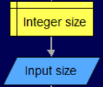
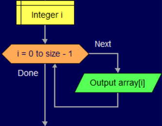
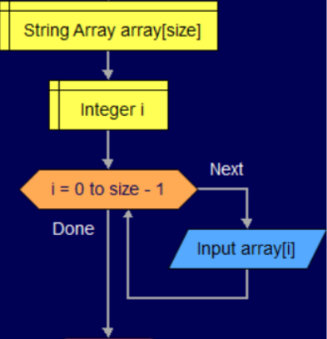
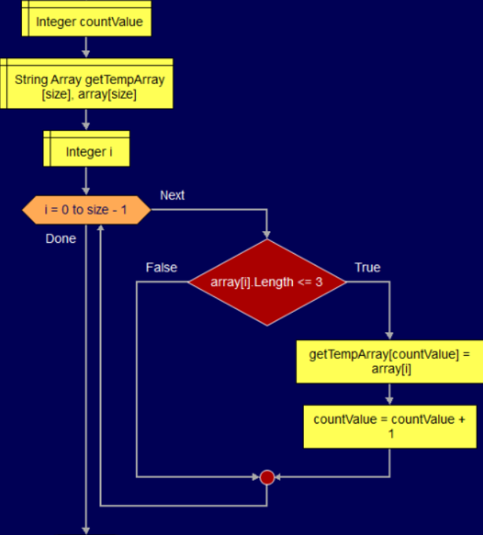
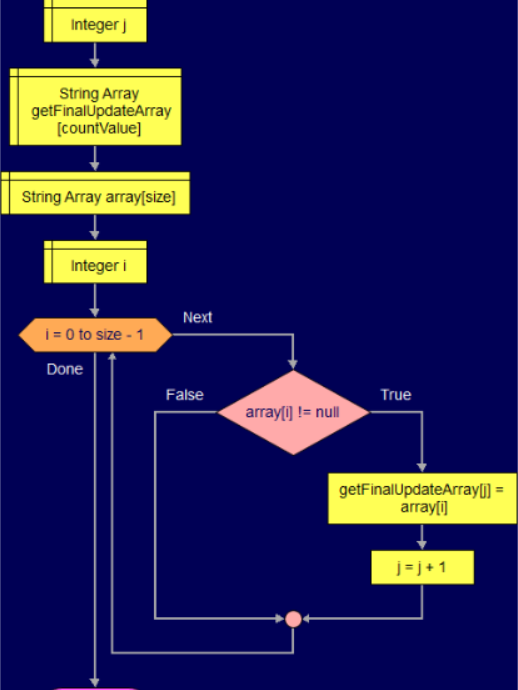

**Итоговое задание по основному блоку:**
1. Создать репозиторий на GitHub
2. Нарисовать блок-схему алгоритма (можно обойтись блок-схемой основной содержательной части, если вы выделяете её в отдельный метод)
3. Снабдить репозиторий оформленным текстовым описанием решения (файл README.md)
4. Написать программу, решающую поставленную задачу
5. Использовать контроль версий в работе над этим небольшим проектом (не должно быть так, что всё залито одним коммитом, как минимум этапы 2, 3, и 4 должны быть расположены в разных коммитах)

**Задача:** Написать программу, которая из имеющегося массива строк формирует новый массив из строк, длина которых меньше, либо равна 3 символам. 
Первоначальный массив можно ввести с клавиатуры, либо задать на старте выполнения алгоритма. 
При решении не рекомендуется пользоваться коллекциями, лучше обойтись исключительно массивами.

**Примеры:**
[“Hello”, “2”, “world”, “:-)”] → [“2”, “:-)”]
[“1234”, “1567”, “-2”, “computer science”] → [“-2”]
[“Russia”, “Denmark”, “Kazan”] → []

**Решение:**
1. Задаем длину строкового массива(size).

2. Вводим значения элементов масссива.

3. Выводим полученный массив в консоль.

4. В отдельном методе в промежуточный массив длины(size) записываем значения элементов, удовлетворяющих условию и считаем количество таких элементов(countValue).

5. В отдельном методе в конечный массив длины(countValue) записываем значения из промежуточного массива.

6. Выводим массив в консоль.

